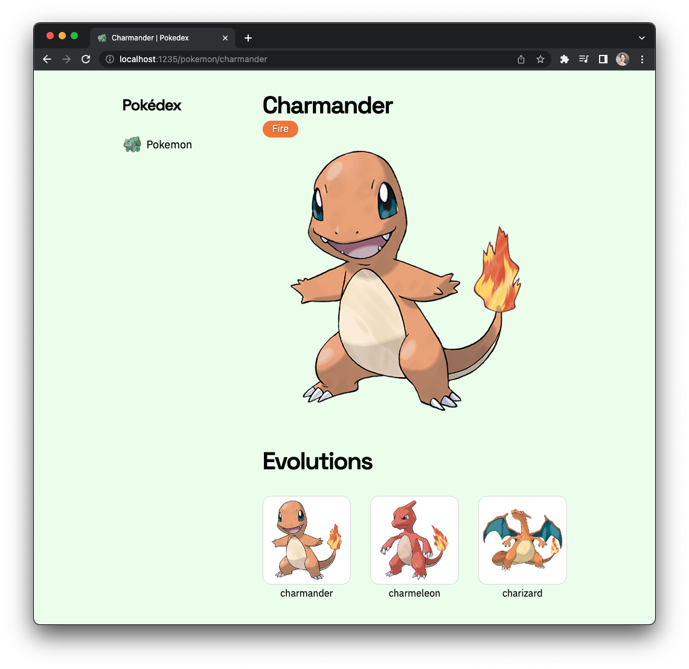

# @ryannhg/pokedex
> a pokedex app built with [Elm Land](https://elm.land)

## local development

To abide by PokeAPI's [Fair Use Policy](https://pokeapi.co/docs/v2#fairuse), you'll need to run a server like [@ryannhg/pokeapi-cache-server](https://github.com/ryannhg/pokeapi-cache-server) to prevent getting your IP perma-banned.

When your local PokeAPI is up-and-running, you can run this frontend project with one command:

```
npx elm-land server
```

The Pokedex app will be running at [http://localhost:1234](http://localhost:1234)

